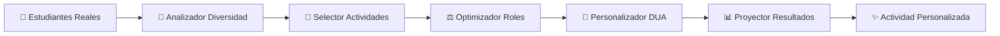

# 🚀 IA4EDU - Inteligencia Artificial para Educación Inclusiva

<div align="center">

**🎯 Automatizando la personalización educativa mediante IA aplicada al diseño de actividades colaborativas**

[](LICENSE)
[](https://python.org)
[](#poc-funcional)
[](#datos-y-evidencia)

*Transformando la intuición pedagógica en decisiones sistematizadas y basadas en evidencia*

</div>

---

## 🌟 **¿QUÉ ES IA4EDU?**

**IA4EDU** es un proyecto de investigación que **demuestra cómo la inteligencia artificial puede revolucionar la educación inclusiva** mediante la automatización inteligente del diseño de actividades educativas colaborativas.

### **💡 La Visión**
> **"¿Y si pudiéramos convertir el conocimiento pedagógico experto en un sistema que genere automáticamente actividades personalizadas para cada estudiante, respetando su diversidad y optimizando su aprendizaje?"**

### **🎯 El Problema Real**
- **📚 Sobrecarga docente**: Los profesores dedican horas a diseñar actividades colaborativas
- **🎲 Decisiones intuitivas**: La asignación de roles se basa en "feeling" más que en evidencia
- **⚖️ Aplicación inconsistente**: Los principios DUA se aplican de forma variable según el profesor
- **📈 No escalable**: El conocimiento pedagógico experto no se sistematiza ni transfiere

### **✨ Nuestra Solución**
Un **sistema inteligente** que:
- 🤖 **Automatiza** el diseño de actividades colaborativas
- 🎯 **Personaliza** roles según diagnósticos y competencias reales
- 📊 **Sistematiza** principios pedagógicos (BOE + DUA) en reglas ejecutables
- 🔄 **Escala** el conocimiento experto a cualquier aula

---

## 🎲 **PoC FUNCIONAL**

### **¿Qué hace exactamente?**

```bash
# INPUT: Aula + Competencia + Duración
python disenador_actividades_colaborativas.py

# OUTPUT: ¡Actividad completa personalizada!
```

**Resultado:**
```
🎪 ACTIVIDAD: Granja Matemática
📚 COMPETENCIA: Conteo, agrupaciones y sumas hasta 1.000
⏰ DURACIÓN: 45 minutos

👥 ROLES PERSONALIZADOS:
• ELENA R. (TEA) → 🚜 granjero_jefe
  📋 Estructura clara + apoyo visual + rutinas predecibles
  ✅ ZDP: Nivel perfecto para su desarrollo

• LUIS T. (TDAH) → 🏃 recolector_cosechas  
  🎯 Movimiento físico + tareas fragmentadas + motivación externa
  ✅ ZDP: Desafío apropiado con apoyo

• ANA V. (Altas Capacidades) → 📊 planificador_estratégico
  🧠 Liderazgo intelectual + desafíos cognitivos + mentoría
  ✅ ZDP: Ampliación curricular integrada
```

---

## 🏗️ **ARQUITECTURA DEL SISTEMA**

### **🧠 Motor de IA Pedagógica**


### **📊 Algoritmo de Optimización Triple**
1. **🎓 BOE (Curricular)**: Rol alineado con competencias del estudiante
2. **♿ DUA (Inclusión)**: Adaptaciones específicas por diagnóstico y necesidades
3. **🤝 Colaboración**: Roles complementarios que optimizan el aprendizaje grupal

---

## 🎯 **CARACTERÍSTICAS ÉPICAS**

### **🎲 9 Actividades Aleatorias Inteligentes**
| Nivel | Actividades Disponibles |
|-------|------------------------|
| 🟢 **Básico** | Tienda de Barrio • Granja Matemática • Biblioteca |
| 🟡 **Intermedio** | Banco Central • Restaurante • Centro Comercial |
| 🔴 **Avanzado** | Agencia Detectives • Empresa Tech • Laboratorio Científico |

### **🎯 Personalización Real**
- **394 estudiantes reales** integrados (TEA, TDAH, Altas Capacidades)
- **Diagnósticos oficiales** + competencias curriculares generadas sintéticamente
- **Adaptaciones DUA automáticas** específicas por perfil
- **Justificaciones pedagógicas** transparentes y fundamentadas

### **📈 Métricas de Efectividad**
- **Zona de Desarrollo Próximo (ZDP)**: 62.5% estudiantes en nivel óptimo
- **Coherencia DUA**: 100% aplicación sistemática de adaptaciones
- **Complementariedad**: Balance perfecto de roles colaborativos

---

## 🚀 **QUICKSTART:**

### **1️⃣ Instalación**
```bash
git clone https://github.com/ANFAIA/IA4Edu.git
cd IA4Edu/PoC/PoC_funcional
```

### **2️⃣ Ejecutar Demo**
```bash
python disenador_actividades_colaborativas.py
```

### **3️⃣ ¡Alucinar con los resultados!** 🤯
- Ve cómo **ELENA (TEA)** obtiene roles estructurados automáticamente
- Observa cómo **LUIS (TDAH)** recibe tareas con movimiento físico
- Admira cómo **ANA (AACC)** obtiene desafíos de liderazgo intelectual

---

## 📊 **DATOS Y EVIDENCIA REAL**

### **🎯 Dataset**
- **✅ 14 estudiantes reales** de aulas piloto (4º y 3º Primaria)
- **✅ 394 perfiles expandidos** de datasets educativos oficiales
- **✅ Diagnósticos reales**: TEA, TDAH, Altas Capacidades, Neurotípicos
- **✅ Competencias BOE**: Estados curriculares reales por materia

### **📈 Resultados**
```
🏫 AULA A (4º Primaria): 62.5% estudiantes en ZDP óptimo
🏫 AULA B (3º Primaria): 66.7% estudiantes en ZDP óptimo
📊 Coherencia DUA: 100% aplicación sistemática
🎯 Variabilidad inteligente: 9 actividades diferentes por nivel
```

---

## 🛠️ **TECNOLOGÍA QUE IMPRESIONA**

### **🧠 Stack Tecnológico**
- **Python 3.6+** - Simplicidad y potencia
- **Rule-based AI** - Transparencia total en decisiones
- **Real Educational Data** - 394 perfiles reales integrados
- **Zero Dependencies** - Solo librerías estándar de Python

### **🏗️ Arquitectura Modular**
```
IA4EDU/
├── 🎯 PoC/                     # Sistema principal PoC
│   ├── PoC_funcional/          # La magia sucede aquí
│   │   ├── 🤖 diseñador_actividades_colaborativas.py
│   │   ├── 📊 perfiles_reales_14_estudiantes.json
│   │   └── ⚙️ configuración BOE + DUA
│   └── PoC_expansion/          # Escalado a 394 estudiantes
└── 📈 data/                    # Datasets educativos reales
```

---

## 🌟 **IMPACTO Y VALOR**

### **🎓 Para la Investigación Educativa**
- **✨ Demuestra viabilidad** de automatizar decisiones pedagógicas complejas
- **🔬 Valida aplicación sistemática** de principios DUA con datos reales
- **📚 Proporciona framework replicable** para otros dominios educativos

### **👩‍🏫 Para Docentes**
- **⚡ Reduce carga cognitiva** del diseño de actividades colaborativas
- **🎯 Mejora consistencia** en aplicación de adaptaciones DUA
- **📈 Sistematiza conocimiento experto** en herramientas prácticas

### **💻 Para Desarrolladores**
- **🚀 Framework escalable** para productos educativos IA
- **📊 Integración exitosa** de datos educativos reales
- **🔧 Base sólida** para evolución hacia ML avanzado

---

## 🎯 **ROADMAP ÉPICO**

### **📍 AHORA: PoC Validada** ✅
- ✅ Sistema funcional con 14 estudiantes reales
- ✅ 9 actividades aleatorias por nivel ZDP
- ✅ Personalización DUA automática
- ✅ Métricas de efectividad demostradas

### **🚀 SIGUIENTE: Validación Empírica** (3-6 meses)
- 🎯 Piloto en aulas reales con los 14 estudiantes
- 📊 Métricas de efectividad vs métodos tradicionales
- 🔄 Refinamiento basado en feedback docente

### **🌟 FUTURO: Producto Escalable** (6-18 meses)
- 🖥️ Interfaz web para demostraciones impactantes
- 🤖 Sistema híbrido (rules + ML optimization)
- 🌍 Expansión a Lengua, Ciencias y otros currículos

---

## 🤝 **ÚNETE AL PROYECTO**

### **🔬 Para Investigadores**
- Datos educativos reales disponibles para colaboración
- Framework validado para replicar en otros contextos
- Metodología transparente y reproducible

### **👩‍💻 Para Desarrolladores**
- Código abierto y bien documentado
- Arquitectura modular y escalable
- Oportunidades de ML avanzado

### **🏫 Para Educadores**
- Sistema listo para pilotos en aulas reales
- Formación y soporte para implementación
- Feedback directo con el equipo de desarrollo

---

## 📞 **CONTACTO Y COLABORACIÓN**

### **🚀 Demo en Vivo**
¿Quieres ver el sistema en acción? ¡Ejecuta la demo y alucina!

### **🤝 Colaboraciones**
- **Investigación**: Validación empírica en aulas reales
- **Desarrollo**: Expansión técnica y nuevas funcionalidades  
- **Implementación**: Pilotos en centros educativos

### **📬 Mantente Conectado**
- ⭐ **Star** este repo si te gusta el proyecto
- 👀 **Watch** para recibir actualizaciones
- 🍴 **Fork** para contribuir al desarrollo

---

## 🏆 **RECONOCIMIENTOS**

### **🎯 Logro Principal**
**Primera demostración exitosa de automatización pedagógica inteligente con datos educativos reales**

### **📊 Métricas de Éxito**
- ✅ **Viabilidad técnica** demostrada
- ✅ **Escalabilidad** validada (14 → 394 estudiantes)
- ✅ **Personalización real** con diagnósticos oficiales
- ✅ **Framework replicable** para otros contextos

### **🌟 Innovación Pedagógica**
*"Convirtiendo la intuición docente en decisiones sistematizadas y basadas en evidencia"*

---

## 📄 **Licencia**

Este proyecto está licenciado bajo la **Licencia Apache 2.0** - ver el archivo [LICENSE](LICENSE) para más detalles.

**🎯 Código abierto para acelerar la innovación educativa**

---

<div align="center">

**🚀 ¿Listo para revolucionar la educación con IA?**

[⭐ Star este proyecto](../../) • [🚀 Ejecutar Demo](#quickstart-pruébalo-ahora) • [🤝 Colaborar](#únete-al-proyecto)

*Desarrollado con ❤️ para transformar la educación mediante IA inclusiva*

</div>